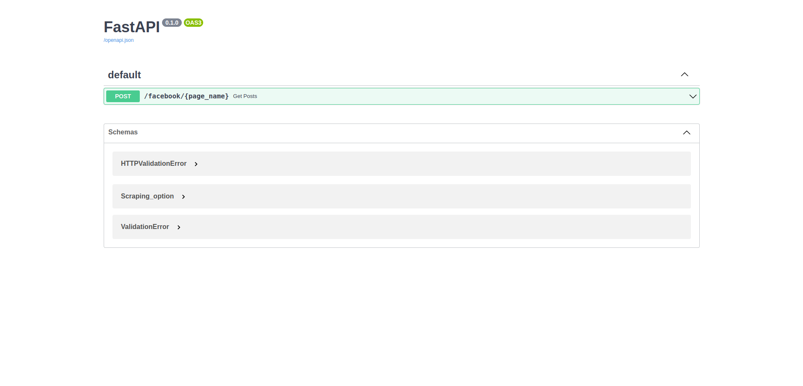
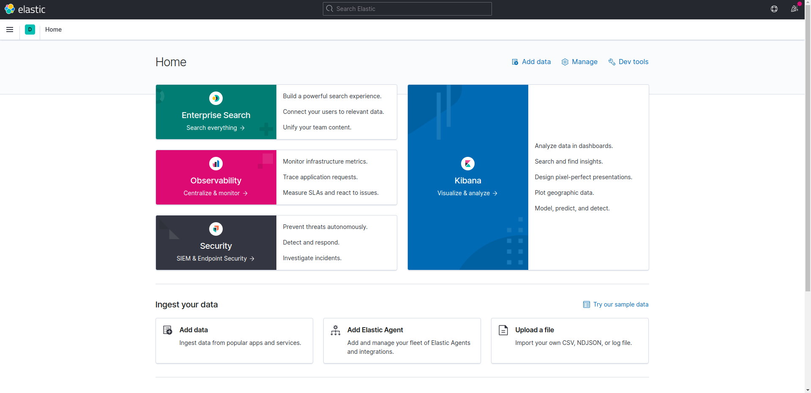

# Social Media Scraper

The data presented in social media can be very important and useful to complete the picture or to create a more powerful Machine learning Model. For this creating a platform that can manage all of this can be a really good idea.

## Installation

To install and run the project it's relatively very easy. You just need to execute the `docker-compose.yml` file.

```bash
git clone https://github.com/tarekseguir/social_media_scraper.git

cd social_media_scraper

docker-compose up
```

And with this you are ready to go.

## Usage

When you finish creating the enviorement you can access the swagger API to test the app.

### Swagger-ui :
[http://127.0.0.1/docs](http://127.0.0.1/docs).



Here also the kibana url to be able to query data and even creating charts and dashboards with no code. We choose elasticsearch as our database because it's a full text search engine and will enable us to search inside the texts

### Kibana :
[http://127.0.0.1:5601/app/home/](http://127.0.0.1:5601/app/home#/)

